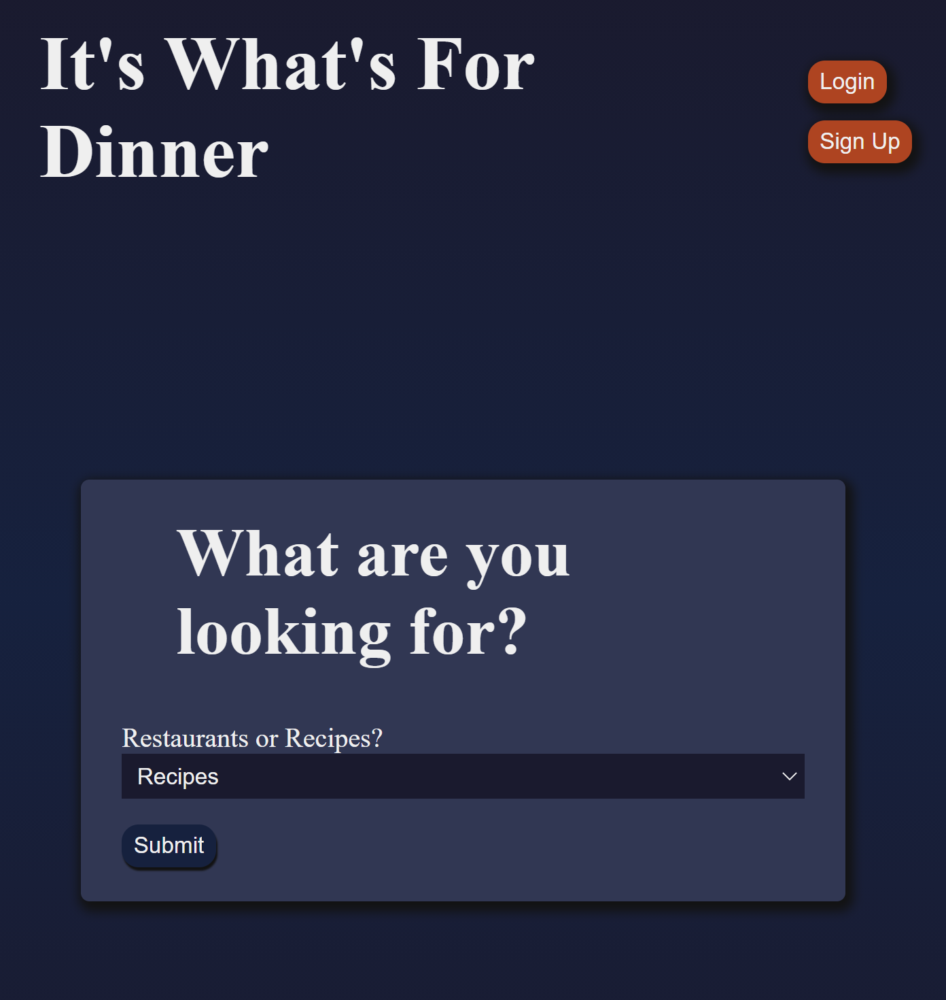
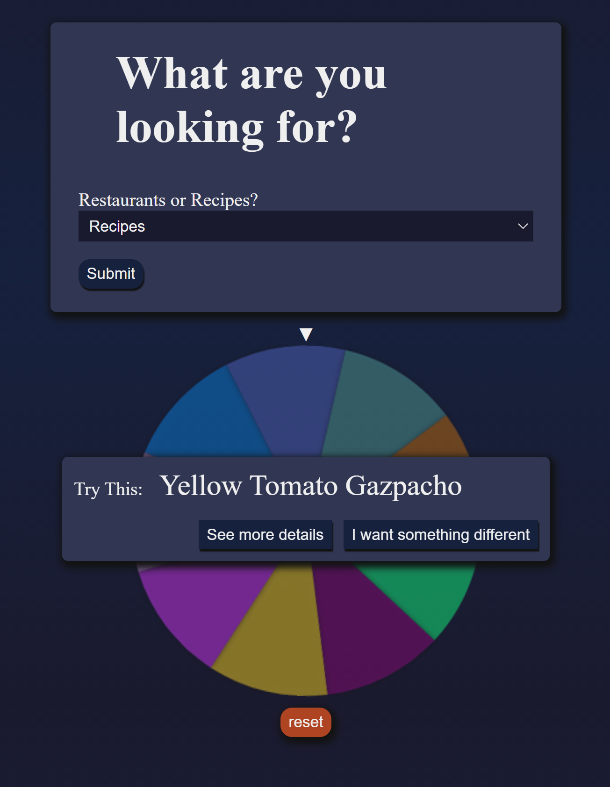

# What's For Dinner

Helps users choose what to do for dinner with the help of a fun spinning wheel

Thinkful first solo capstone project

### Live link is [here](https://whats-for-dinner-client.vercel.app/)

### Stack Used: HTML, CSS, JavaScript React, Node.js, Express, PostgreSQL

### ScreenShots




In the future, I would like to add api for food delivery service with affiliate links and monetize with ads. I would also like to use an api to help users find restaurants that are near them so the results will be based on an input of their zip code.

A user can sign up and login. They can choose between restaurants and recipes, spin a wheel, and get a result about what they should do for dinner. As an authenticated user they can add their own restaurants/recipes and favorites. 

## Documentation

This API allows you to interact with endpoints:

### Open: /api/restaurants
#### Method: GET
url: /api/restaurants/
##### Success Response
Code: 200 ok
Sample Response:
```
{
  [
    {
      "id": 4,
      "title": "Five Guys",
      "phone_number": "(704) 333-4450",
      "web_url": "http://www.fiveguys.com/",
      "style": "chain",
      "restaurant_address": " 2810 South Blvd Unit A, Charlotte, NC 28209",
      "user_id": null
    }, ...
  ]
}
```
<hr />

### Closed: /api/restaurants
#### Method: POST /
url: /api/restaurants/
##### Success Response:
code: 201 created <br />
Required Values: title and style in request body. Style value MUST be either 'local' or 'chain' <br />
Optional Values: phone_number: restaurant phone number, web_url: restaurant website, restaurant_address, user_id: value can be null, or it must match the logged in user's id <br />
Sample Request:
```
{
    "title": "My Fav New Restaurant",
    "phone_number": "(123) 456-7890",
    "web_url": "http://www.restaurantWebSite.com/",
    "style": "local",
    "restaurant_address": " 123 Main St, AnyTown, LA 22222",
    "user_id": null
}
```
Sample Response:
```
{
    "id": 48,
    "title": "My Fav New Restaurant",
    "phone_number": "(123) 456-7890",
    "web_url": "http://www.restaurantWebSite.com/",
    "style": "local",
    "restaurant_address": " 123 Main St, AnyTown, LA 22222",
    "user_id": null
}
```

#### Method: DELETE 
url: /api/restaurants/:restaurant_id

##### Success Response: 
Code: 204 no content <br />
Required Value: restaurant_id

#### Method: PATCH 
url: /api/restaurants/:restaurant_id
##### Success Response:
Code: 200 ok

<hr />

### Open: /api/recipes
#### Method: GET
url: /api/recipes/
##### Success Response
Code: 200 ok
Sample Response:
```
{
  [
    {
        "id": 1,
        "title": "Herbed Oyster Mushroom Steak",
        "content": "Preheat oven to 375 degrees. Zest and juice lemon into a medium bowl. Add chopped parsley, scallion bulbs, olive oil, onion powder, and garlic powder. Whisk to combine. etc...",
        "user_id": null
    }, ...
  ]
}
```
#### Method: GET
url: /api/recipes/:recipe_id
##### Success Response
Code: 200 ok
Sample Response:
```
{
  "id": 1,
  "title": "Herbed Oyster Mushroom Steak",
  "content": "Preheat oven to 375 degrees. Zest and juice lemon into a medium bowl. Add chopped parsley, scallion bulbs, olive oil, onion powder, and garlic powder. Whisk to combine. etc...",
  "user_id": null,
  "ingredients": [
        {
            "id": 1,
            "ingredient": "Oyster Mushrooms",
            "unit": "lb",
            "amount": "1",
            "recipe_id": 1
        }, ...
  ]
}
```
<hr />

### Closed: /api/recipes
#### Method: POST /:recipe_id
url: /api/recipes/:recipe_id
##### Success Response:
code: 201 created <br />
Required Values: title and content in request body <br />
Optional Values: user_id value can be null, or it must match the logged in user's id <br />
Sample Request:
```
{
    "title": "Seared Trout with Lemon",
    "content": "Preheat the oven to 375. Make sure there are no scales left on the fish. Pat the fish dry with a paper towel, then coat lightly in oil. etc...",
    "user_id": null
}
```
Sample Response:
```
{
    "id": 234,
    "title": "Seared Trout with Lemon",
    "content": "Preheat the oven to 375. Make sure there are no scales left on the fish. Pat the fish dry with a paper towel, then coat lightly in oil. etc...",
    "user_id": null
}
```
#### Method: DELETE /:recipe_id
url: /api/recipes/:recipe_id

##### Success Response
Code: 204 no content
Required Value: recipe_id

#### Method: PATCH /:recipe_id
url: /api/recipes.:recipe_id
##### Success Response
Code: 200 ok
<hr />

Open: /api/login
POST

Open: /api/users
POST

Closed: /api/dinner
GET /:user_id/restaurants
GET /:user_id/recipes
GET /:user_id/favorites
POST /:user_id/favorites
DELETE /:user_id/favorites


### Deploying

When your new project is ready for deployment, add a new Heroku application with `heroku create`. This will make a new git remote called "heroku" and you can then `npm run deploy` which will push to this remote's main branch.
